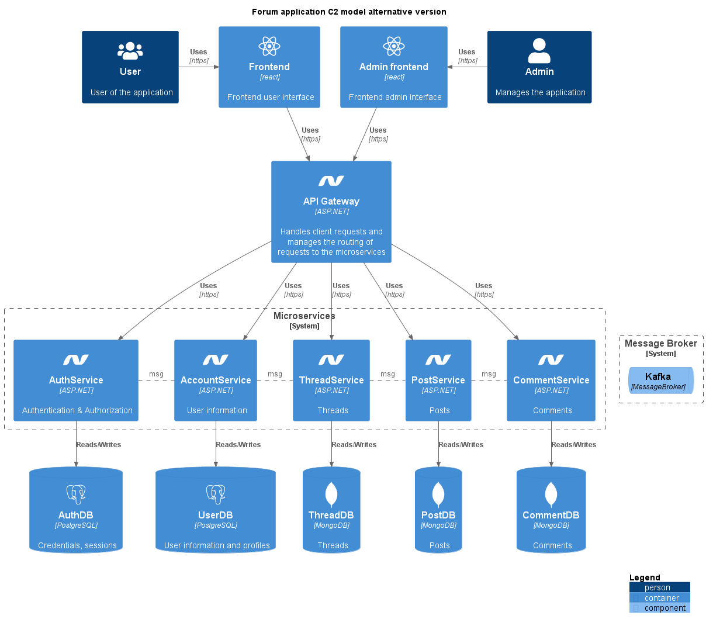
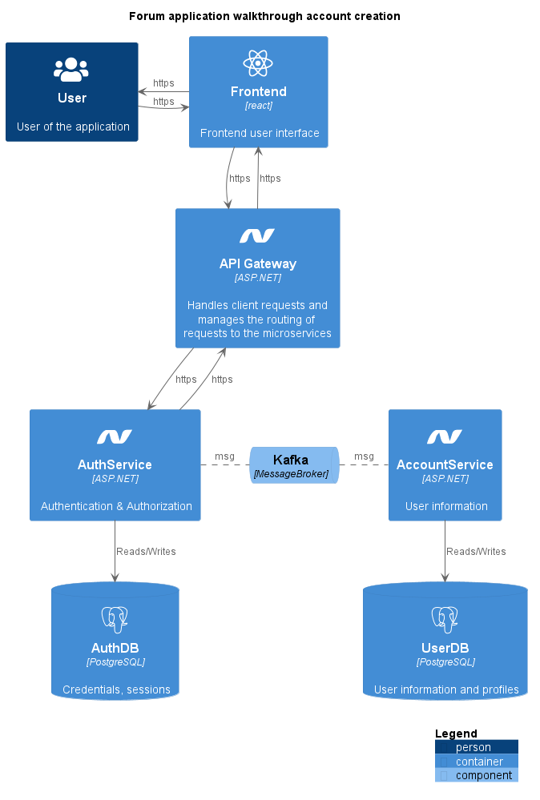
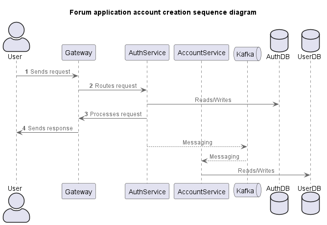
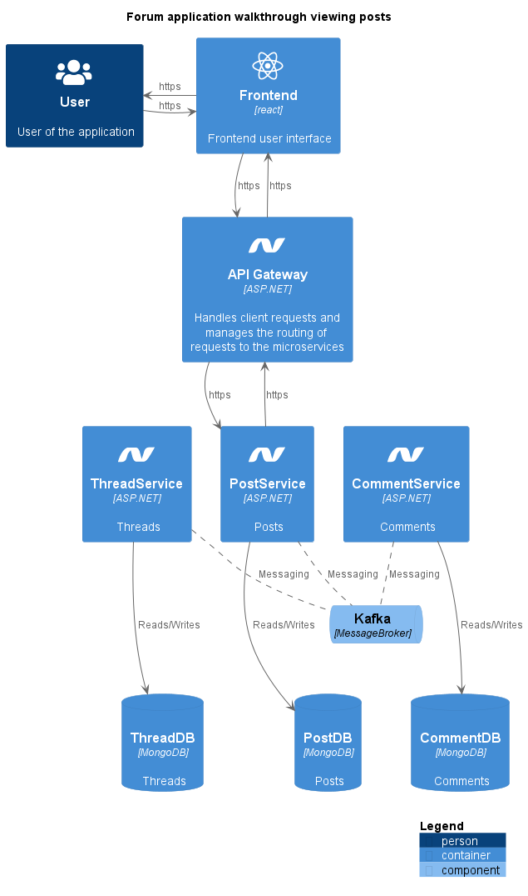
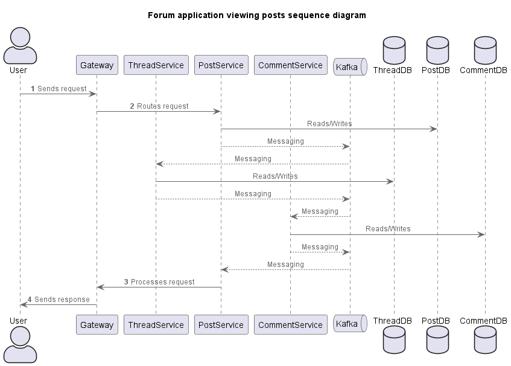

# Architecture

Architecture models of my forum application.

## C1: Context

In the C1 model you can find an overview of the context of the forum application. In this model you can see that the forum application does not use any external services.

## C2: Containers

In the C2 model you take a look at the various containers that will be part of a software application. In this model you can see what services I will be using in the forum application and what technologies are being used. In the development document you can see the reasoning behind the technology choices.

Since I won't have time to develop everything in this diagram I also made an alternative version of the C2 diagram that only contains the parts I will be implementing in this semester.

## Sequence and Walkthrough diagrams

To make it more clear how traffic travels in my architecture I made a sequence and walkthrough diagram for 2 user stories/scenarios. The first being account creation and the second viewing posts. Both of these scenarios have multiple microservices that need to perform certain actions. With the help of these diagrams you can get a clearer view of how messaging is used in the forum application and how requests are handled.

### Account Creation

### Viewing Posts

## C3: Components

The C3 model looks more in depth at a container of the C2 model. In this model you can see how one container works and what components a container has as well as the components directly connected to this component of the container.

Since the containers of my application will be built using a largely similar pattern I have only created a C3 diagram for one of my containers. 

