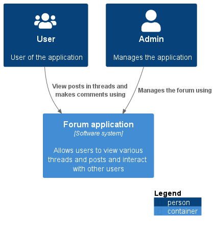
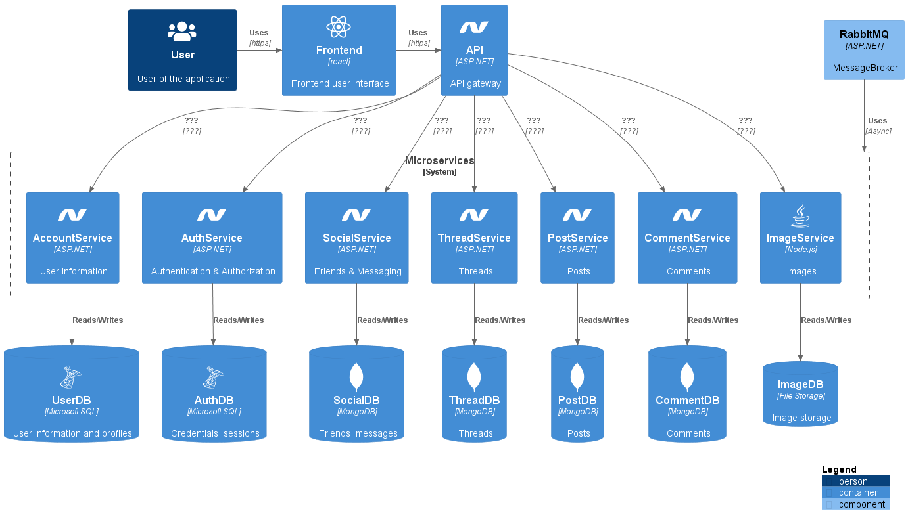
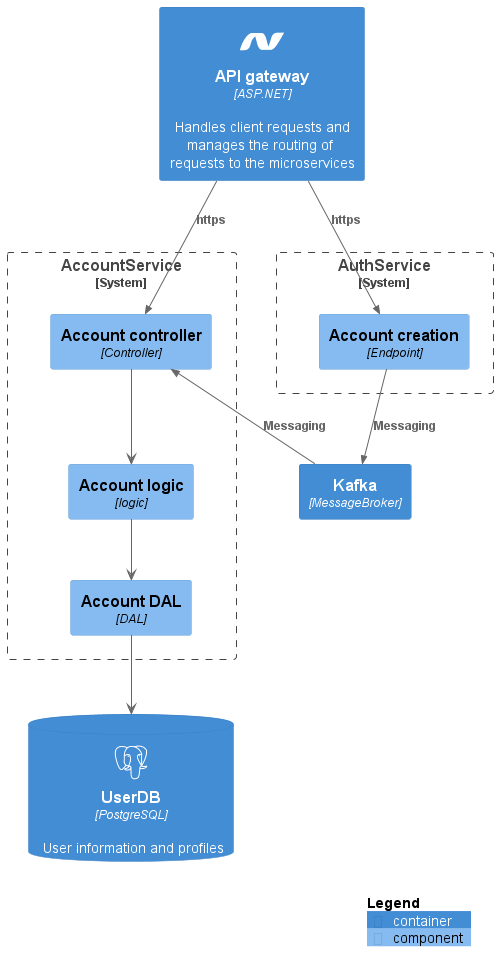

# Architecture

Architecture models of my forum application.

## C1: Context

In the C1 model you can find an overview of the context of the forum application. In this model you can see that the forum application does not use any external services.

## C2: Containers

In the C2 model you take a look at the various containers that will be part of a software application. In this model you can see what services I will be using in the forum application and what technologies are being used.

## C3: Components

The C3 model looks more in depth on a container of the C2 model. In this model you can see how one container works and what components a container has.

