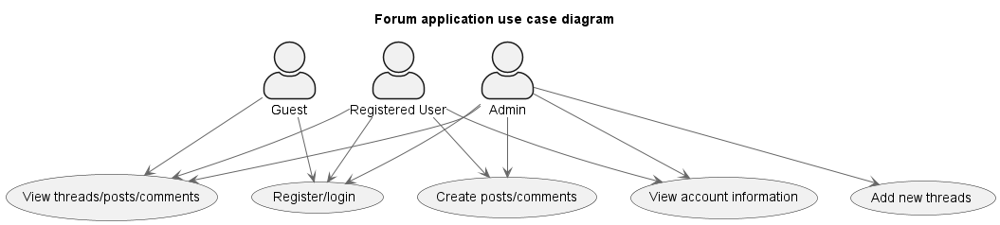
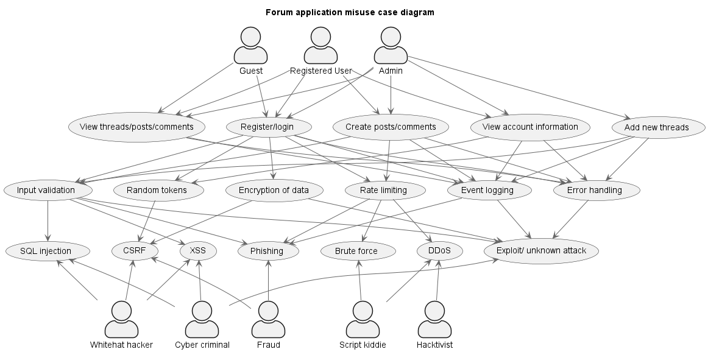

# Security

Security diagrams for my application

## Use case diagram

This diagram shows different use cases for my application

## Misuse case diagram

This diagram extends the normal use case diagram to also contain various misuse cases for the application. In this diagram you can also find various security measures linked to each (mis)use case.

